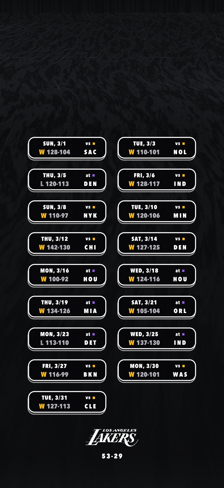

# Lakers Lock Screen

A self-updating iPhone lock screen showing every Lakers game this month, pulled
live from ESPN. Finished games flip from tip-off time to a gold **W** or grey
**L** with the final score, the season record under the wordmark recalculates,
and on the 1st the whole grid rolls over to the new month.



---

## Why this is a wallpaper and not a widget

iOS gives third-party code two small slots on the lock screen — the inline strip
above the clock and a widget row that fits at most two rectangular widgets of
roughly 160×72 points. There is no public API for a full-screen lock screen
widget, and no third-party app can set the wallpaper on its own.

So the schedule grid is rendered **into the wallpaper image**, and the
wallpaper is swapped on a schedule by a Shortcuts automation, which *is*
allowed to call *Set Wallpaper*. The practical consequence:

> The screen updates when the automation runs, not the instant a game ends.
> Three refreshes a day is usually enough; a game ending at 10pm PT shows its
> W by the 11pm run.

---

## Quick start

```bash
python3 -m venv .venv && ./.venv/bin/pip install -r requirements.txt
```

```bash
./.venv/bin/python generate.py --device iphone-17-pro -o out/wallpaper.png
```

That writes a native-resolution PNG of the current month. If the current month
has no games (June–September), it rolls forward to the next month that does.

Use your own background photo — this is what makes it look like the reference:

```bash
./.venv/bin/python generate.py --bg ~/Pictures/dark-water.jpg -o out/wallpaper.png
```

Or drop the image at `assets/backgrounds/default.jpg` and it is picked up
automatically. With no photo, a synthetic dark-water texture is generated.

### Pick your device

Render at exactly your screen's pixel size or iOS will rescale and crop it.

| Preset | Pixels | Models |
| --- | --- | --- |
| `iphone-17-pro` | 1206×2622 | 17 Pro, 17 |
| `iphone-17-pro-max` | 1320×2868 | 17 Pro Max |
| `iphone-16-pro-max` | 1320×2868 | 16 Pro Max |
| `iphone-16-pro` | 1206×2622 | 16 Pro |
| `iphone-15-pro-max` | 1290×2796 | 16 Plus, 15 Pro Max, 15 Plus, 14 Pro Max |
| `iphone-15-pro` | 1179×2556 | 16, 15 Pro, 15, 14 Pro |
| `iphone-14` | 1170×2532 | 14, 13, 13 Pro, 12 |
| `iphone-13-mini` | 1080×2340 | 13 mini, 12 mini |

Not sure? Take a screenshot, AirDrop it to your Mac, and check its dimensions —
that is your exact pixel size. Or pass `--size 1179x2556` directly.

---

## Getting it onto your phone

### 1. Host the image somewhere your phone can reach

**GitHub Actions (recommended — free, always on, no machine of yours running).**
Push this repo to GitHub, then enable Pages: *Settings → Pages → Deploy from a
branch → `main` / `docs`*. The included workflow re-renders at 11pm, 3am and
10am Pacific and commits the PNG. Your URL becomes:

```
https://<you>.github.io/<repo>/wallpaper.png
```

Set your device with a repo variable (*Settings → Secrets and variables →
Actions → Variables*): name `DEVICE`, value e.g. `iphone-17-pro`.

**Your Mac.** `./.venv/bin/python serve.py` exposes
`http://<your-mac-ip>:8787/wallpaper.png`. Works on your home Wi-Fi; add
Tailscale if you want it away from home. The Mac has to be awake.

**Manual.** Run `generate.py` and AirDrop the PNG whenever you feel like it.

### 2. Build the Shortcut

In the **Shortcuts** app, create a new shortcut named *Lakers Lock Screen*:

1. **Get Contents of URL** — your URL from above. Append a cache-buster so iOS
   and the CDN can't hand you yesterday's image:
   `https://…/wallpaper.png?v=` and then insert the **Current Date** variable.
2. **Set Wallpaper Photo** — it picks up the downloaded image automatically.
   Expand it and turn **Show Preview off** (otherwise it needs a tap every
   time). Leave *Lock Screen* on; turn *Home Screen* off unless you want both.

Run it once by hand to grant the permission prompt.

### 3. Automate it

*Automation* tab → **+** → **Time of Day**:

- 3:30 AM, Daily → Next → pick *Lakers Lock Screen*
- Turn **Ask Before Running off**, and *Notify When Run* off

Add more automations at other times (11:30 PM catches West-coast finals the same
night). Shortcuts allows one automation per time, all pointing at the same
shortcut.

**Requires iOS 17 or later** to run unattended. iOS 16.2–16.7 has the action but
will ask for confirmation each time.

### Lock screen settings that matter

- Turn **Depth Effect off** (long-press lock screen → Customize → the `⋯`
  menu). Depth effect pushes the clock in front of the image and hides chips.
- Turn off **Perspective Zoom** for the same reason.
- *Set Wallpaper Photo* writes to the **currently active** lock screen. If you
  swap between Focus-linked lock screens, it follows whichever is active.

---

## What updates

| Element | Behaviour |
| --- | --- |
| Upcoming game | `7:30 PM` in your local timezone |
| In progress | red `LIVE` plus the running score |
| Final | gold `W` or grey `L`, winner's score first |
| Gold swatch | home game (`vs`) |
| Purple swatch | away game (`at`) |
| Record | regular-season W–L for the displayed season |
| Month | dates in the current calendar month; rolls over on the 1st |

Playoff games appear automatically once ESPN publishes them, but are excluded
from the record (that is the usual convention). Pass `--playoff-record` to
include them.

---

## Options

```
--device / --size      output resolution
--month YYYY-MM        render a specific month (default: current)
--tz                   timezone for tip-off times (default America/Los_Angeles)
--bg PATH              background photo, cover-cropped to fit
--scrim 0..1           darkening behind the grid for legibility (default 0.34)
--no-scores            bare W/L with no final score
--playoff-record       count playoff games in the record
--show-month           print the month name above the wordmark
--wordmark PATH        use your own wordmark PNG
--logo-width 0.235     wordmark size as a fraction of screen width
--font PATH            override the font (--font-variation Bold for variable fonts)
--team lal             any ESPN NBA team slug
--ttl SECONDS          reuse cached ESPN data (0 = always refetch)
```

Colours, spacing and type sizes live in `lakerscreen/config.py` as fractions of
the image, so every tweak scales across devices.

---

## How it works

| File | Role |
| --- | --- |
| `lakerscreen/espn.py` | fetches + normalises the schedule, caches to disk |
| `lakerscreen/render.py` | lays out the grid and draws the chips |
| `lakerscreen/background.py` | cover-crops your photo, or synthesises water |
| `lakerscreen/assets.py` | fonts, letter-spaced text, logo extraction |
| `lakerscreen/config.py` | device presets, palette, all layout constants |

Two details worth knowing:

- **ESPN rejects most user-agents** with a 403, including browser-like strings.
  A short list is tried in order. If every request fails, the last cached
  response is used rather than producing a broken wallpaper.
- **ESPN publishes no standalone wordmark.** The primary logo is a two-colour
  lockup — purple lettering over a gold ball — so the lettering is isolated by
  colour-keying on the team colour and recoloured white.
